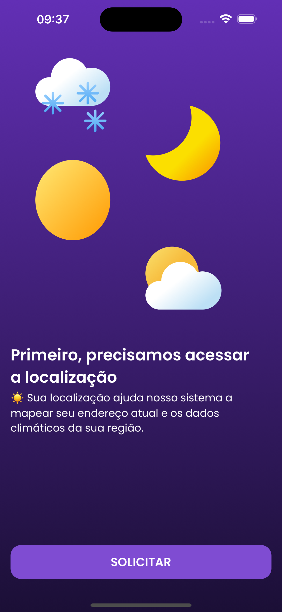
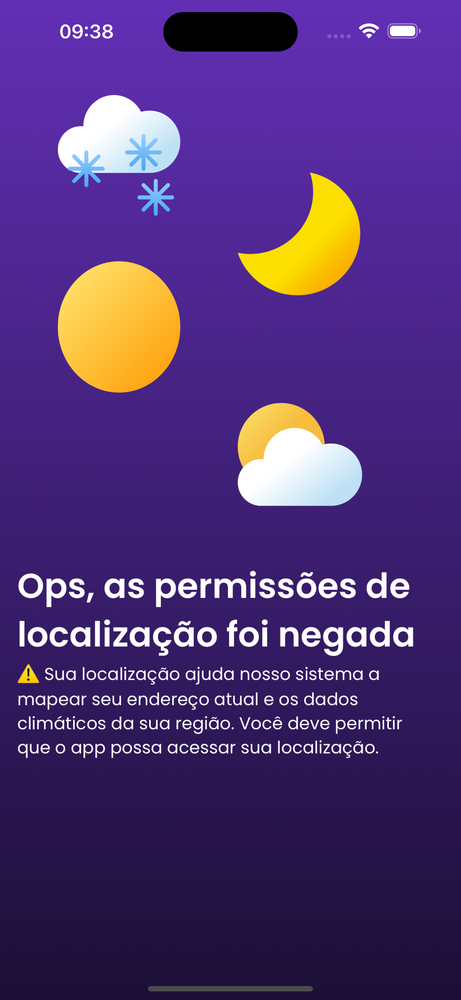
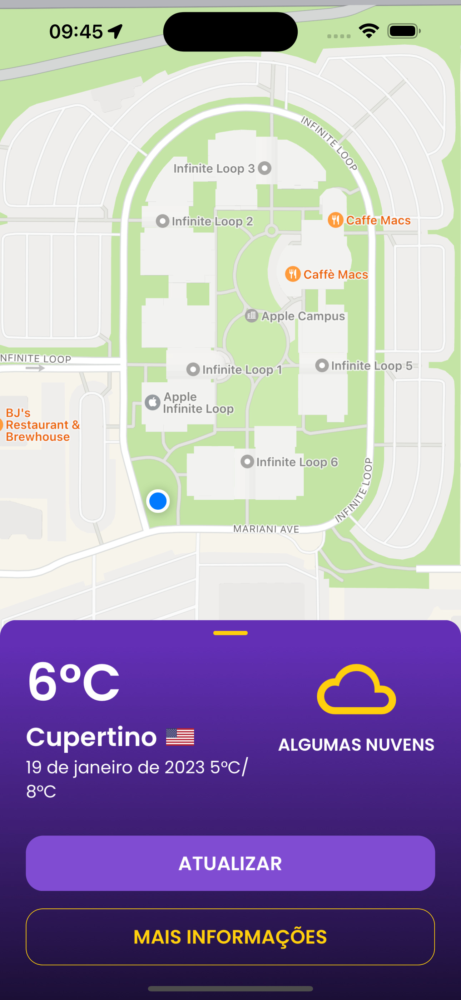
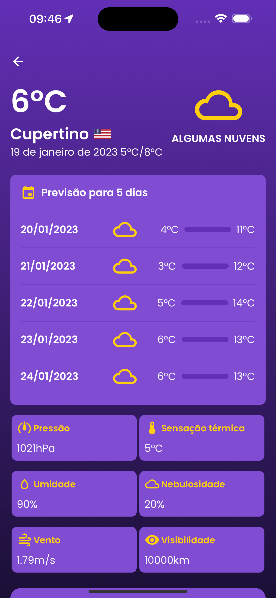
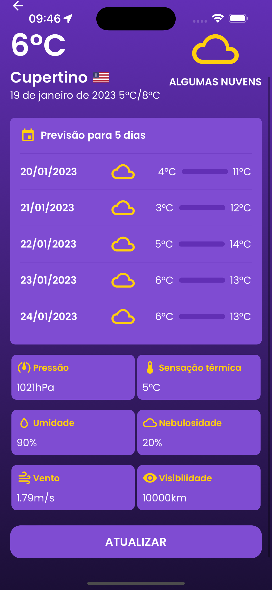
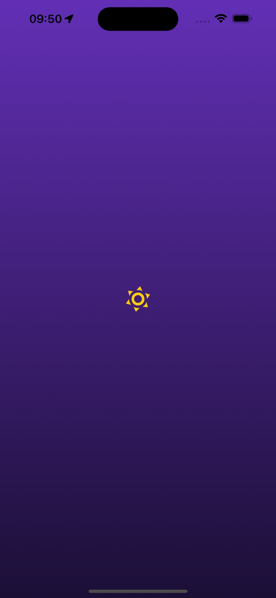

# Builders - Desafio Técnico

Desenvolver um aplicativo que consuma a localização atual do usuário e exiba na interface o endereço atual os dados climáticos da região e um botão para atualizar os dados.


[Clique para mais informações do desafio.](./docs/REQUIREMENTS.md)

## Começando 👋

Primeiro vamos clonar o projeto:

```shell
$ git clone https://https://github.com/gustafsilva/builders-app
```

Entre na pasta do projeto clonado, instale as dependências e inicie o servidor de desenvolvimento:

```shell
$ cd builders-app/
$ cp .env.example .env # Defina OPEN_WEATHER_MAP_API_KEY com sua chave obtida em https://openweathermap.org/api
$ yarn
$ yarn start
```

## Scripts 🔥

Na pasta do projeto, você pode executar:

### `yarn start`

Inicie um servidor de desenvolvimento usando o expo.

### `yarn lint`

Analisa todo o código em massa com o linter e prettier.

### `yarn format:check`

Verifique se os arquivos fornecidos estão formatados

### `yarn format:write`

Formata os arquivos utilizando o prettier.

### `yarn test`

Executa os testes unitários.

### `yarn cover`

Coleta e relata a cobertura de código.

## Print Screens 📱

### Permissões:



### Mapa:



### Previsão:



### Outras:



## Principais libs/plataformas utilizadas

- [TypeScript](https://www.typescriptlang.org/)
- [React](http://reactjs.org)
- [React Native](https://facebook.github.io/react-native/)
- [Expo](https://expo.dev/)
- [ESlint](https://eslint.org/)
- [Prettier](https://prettier.io/)
- [MobX](https://mobx.js.org/)
- [React Native Elements](https://reactnativeelements.com/)
- [Testing Library](https://testing-library.com/)
- [Jest](https://jestjs.io/pt-BR/)

## Licença

O conteúdo deste repositório é coberto pela [licença MIT](./LICENSE).
